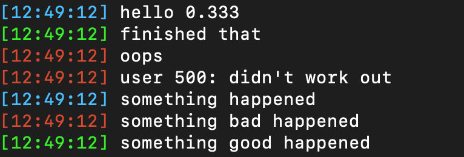

# flog

`flog` is a minimal, formatted, pretty logging package for Go.

It's optimized for human readability.

[Uber's Zap](https://github.com/uber-go/zap) is recommended for more robust logging.

## Install

`go get go.coder.com/flog`

## Usage

```go
flog.Log(flog.INFO, "hello %.3f", 1/3.0)
flog.Log(flog.SUCCESS, "finished that")
flog.Log(flog.ERROR, "oops")

log := flog.New().WithPrefix("user %v: ", 500)

log.Log(flog.ERROR, "didn't work out")
```

produces




